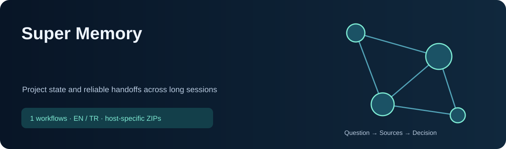

<!-- CURRENT-SKILL-PUBLICATION -->

# Super Memory

1 skill: kaynak araştırma, araç seçimi ve doğrulanabilir sonuç üretme için hazır iş akışları. Modelin ağırlıklarını değiştirmez; sonuç kalitesi kullanılan kaynaklara ve araçlara bağlıdır.

 

**ChatGPT:** bütün listelenen skilleri içeren eklenti paketini indir; hesabının desteklediği kişisel eklenti/skill içe aktarma akışını kullan. Tek-skill ChatGPT bağlantısı, tek skill içeren eklenti ZIP’idir. **Claude:** toplu ZIP’i aç, içindeki tekil skill ZIP’lerini ayrı ayrı yükle. Dış ZIP tek bir Claude skill’i değildir. Yerel kurulum bulut hesabına yükleme yapmaz.

Türkçe veya İngilizce doğal isteklerle kullan; aşağıdaki örnekleri kendi soruna uyarla. Kısa kelimeler seçim ipuçlarıdır; bütün platformlarda aynı slash menüsünü oluşturmaz. Mevcut iş akışları ve güvenlik kuralları korunmuştur.

## Skill listesi

| Skill | Çözdüğü sorun / örnek istek | ChatGPT | Claude |
|---|---|---|---|
| [`super-memory`](skills/common/super-memory/SKILL.md) | Always-on project memory skill for Codex, Claude Code, ChatGPT, and other AI coding sessions. Use automatically at the start of project or coding work, before planning, to locate or create `.ai-handoff/SUPER_MEMORY.md`, read the current packet, compare agent cursors, and keep the file updated after meaningful progress. Also use for `supermemory search`, `supermemory update`, `supermemory new`, `supermemory compress`, `supermemory delete`, `supermemory status`, Super Memory, resume, continue, handoff, context window full, limit reached, switch to Claude Code, switch to Codex, new chat continuation, deleted chat recovery, teammate handoff, devam et, kaldığım yerden devam et, limit bitti, context doldu, and project memory requests. | [↓ ZIP](packages/chatgpt/super-memory.zip) | [↓ ZIP](packages/claude/super-memory.zip) |

## Teknik bilgiler

Claude açıklamaları en fazla 200 karakterdir; her skill paketi en fazla 200 dosya içerir. Kaynaklar, yardımcı betikler ve lisanslar paketlenir. API anahtarları, ücretli erişim, yerel CLI ve canlı veri bağlantıları paketin parçası değildir. Kontroller paket yapısını ve kaynak eşleşmesini doğrular; hesapta yükleme, klinik doğruluk veya yatırım performansı testi yapıldığı anlamına gelmez. [Bütünlük değerleri](downloads/SHA256SUMS.txt) · [Kaynak ve lisans bilgisi](THIRD_PARTY_NOTICES.md).

<!-- END-CURRENT-SKILL-PUBLICATION -->

